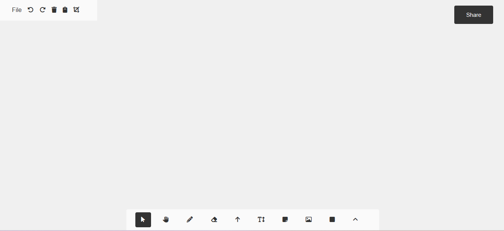

# msDraw - Your Drawing Platform

msDraw is a versatile and user-friendly drawing platform that enables users to create and express their ideas through digital drawings. Whether you're an artist, designer, or simply someone who loves to doodle, msDraw provides a range of tools to bring your creativity to life.

## Features

- **Drawing Tools:** Choose from a variety of drawing tools, including pencils, shapes, text, arrows, and more.
- **Color Palette:** Select colors from a built-in color palette to add vibrancy to your drawings.
- **Layer Management:** Organize your drawings with layers to easily work on different elements.
- **File Import:** Import images and add them to your canvas to incorporate external content.
- **Sharing:** Share your creations with others through a convenient sharing feature.

## Getting Started

Follow these steps to get msDraw up and running on your local machine:

1. Clone the repository:
`git clone https://github.com/BenedictaUche/msdraw.git`, then change directory, 
`cd msdraw`

2. Open `index.html` in your preferred web browser.

## How to Use

- **Drawing Tools:** Choose a tool from the bottom toolbar, such as the pencil, shape, or text tool. Adjust properties using the top toolbar.

- **Import Image:** Click on the picture icon in the bottom toolbar and select an image to import. The image can be resized and positioned on the canvas.

- **Layer Management:** Use the layer system to organize your drawings. You can add, delete, and rearrange layers as needed.

- **Sharing:** Click the "Share" button to share your drawing with others using the built-in sharing functionality.

## Contributing

We welcome contributions to improve msDraw! To contribute:

1. Fork the repository.
2. Create a new branch for your feature: `git checkout -b feature-name`
3. Commit your changes: `git commit -m "Add new feature"`
4. Push to the branch: `git push origin feature-name`
5. Submit a pull request.

## Contact

Have questions or feedback? Contact us at [benedictaonyebuchi.uche@gmail.com](mailto:benedictaonyebuchi.uche@gmail.com).

